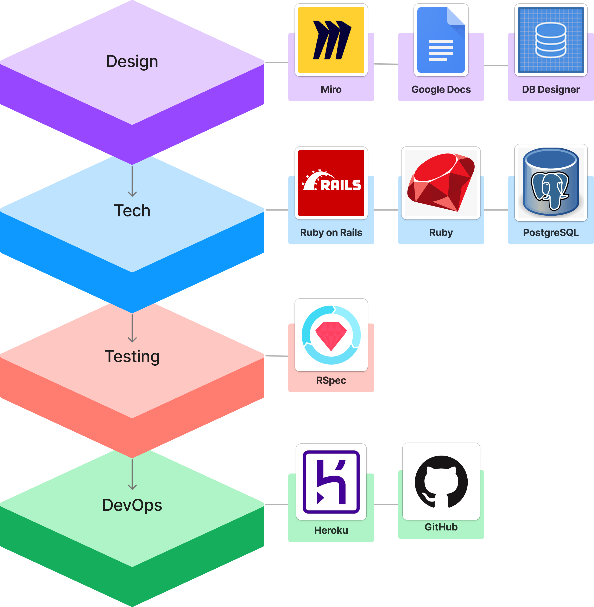

[![Contributors][contributors-shield]][contributors-url]
[![Forks][forks-shield]][forks-url]
[![Stargazers][stars-shield]][stars-url]
[![Issues][issues-shield]][issues-url]

<!-- PROJECT LOGO -->
 

  

  <h1 align="center">🐎 Triple Crown Reference 🐎</h3>

  <h3 align="center">
    Triple Crown of Thoroughbred Racing Database
     
  </h3>

<!-- TABLE OF CONTENTS -->
<h4>
  
Table of Contents

  <ol>
    <li>
      <a href="#about-the-project">About The Project</a>
      <ul>
        <li><a href="#deployment-information">Deployment Information</a></li>
        <li><a href="#built-with">Built With</a></li>
        <li><a href="#database-schema">Database Schema</a></li>
        <li><a href="#learning-goals">Learning Goals</a></li>
      </ul>
    </li>
    <li>
      <a href="#getting-started">Getting Started</a>
      <ul>
          <li><a href="#repository-installation">Repository Installation</a></li>
          <li><a href="#gems-utilized">Gems Utilized</a></li>
      </ul>
    </li>
    <li><a href="#roadmap">Roadmap</a></li>
    <li><a href="#contact">Contact</a></li>
    <li><a href="#acknowledgments">Acknowledgments</li>
    <li><a href="#license">License</a></li></a>
  </ol>
</h4>

<!-- ABOUT THE PROJECT -->
## About The Project

Triple Crown Reference is a Ruby on Rails application built on a PostgreSQL database, curating an extensive record of real and fictional Triple Crown Race winners from the United States, United Kingdom, Canada, and Australia. This comprehensive resource not only catalogs winning horses but also includes details about the associated jockeys, trainers, the year of victory, and if these horses sired future Triple Crown winners. With a user-friendly interface, it serves as a valuable tool for racing enthusiasts, historians, and researchers, combining historical accuracy with imaginative possibilities in the world of horse racing.

(<a href="#top">back to top</a>)

<!-- Deployment Information -->
### Deployment Information

Triple Crown Reference is not currently deployed 😵

* ~~Heroku Deployment~~ 

(<a href="#top">back to top</a>)

<!-- Built With -->
### Built With

(<a href="#top">back to top</a>)

<!-- Database Schema -->
### Database Schema

(<a href="#top">back to top</a>)

<!-- Learning Goals -->
### Learning Goals

* Implement a PostgreSQL database with CRUD functionality and a simple user interface.
* Create instance and class methods on a Rails model that use ActiveRecord methods and helpers.
* Write model and feature tests that fully cover data logic and user behavior.

(<a href="#top">back to top</a>)

<!-- GETTING STARTED -->
## Getting Started

Triple Crown Reference is a monolithic Rails application that provides simple Create, Read, Update, Delete (CRUD) functionality with a user-friendly interface to navigate between entries. Follow the steps below to get started with running the application on your local machine.

<!-- Repository Installation -->
### Repository Installation

1. Clone the repository: `git clone https://github.com/bkeener7/triple_crown`
1. Navigate to the cloned repository's directory: `cd triple_crown`
1. Install gem packages: `bundle install`
1. Setup the database: `rails db:{create,migrate,seed}`
1. Run local RSpec test suite, all tests should be passing: `bundle exec rspec`
1. Start the server: `rails s`
1. Open your web browser and navigate to `localhost:3000`. You should now see the Triple Crown Reference application running locally on your machine.

<!-- Gems Utilized Installation -->
### Gems Utilized

- <b>Capybara</b>: Helps you test web applications by simulating how a real user would interact with your app.
- <b>Launchy</b>: A helper for launching cross-platform applications in a fire and forget manner.
- <b>Orderly</b>: A gem to test the order of items in a list.
- <b>Pry</b>: An IRB alternative and runtime developer console.
- <b>RSpec Rails</b>: Testing framework for Rails 3.x, 4.x, and 5.x.
- <b>Shoulda Matchers</b>: Provides RSpec- and Minitest-compatible one-liners to test common Rails functionality.
- <b>SimpleCov</b>: A code coverage analysis tool for Ruby.
- <b>Pry Rails</b>: Integrates the Pry REPL with Rails.
- <b>RuboCop Rails</b>: Rails-specific static code analysis.
- <b>RuboCop RSpec</b>: Code analyzer for RSpec files.

(<a href="#top">back to top</a>)

<!-- ROADMAP -->
## Roadmap

MVP

* Design a one-to-many relationship using a schema designer.
* Write migrations to create tables with columns of varying data types and foreign keys.
* Use Rails to create web pages that allow users to CRUD resources.
* Create instance and class methods on a Rails model that use ActiveRecord methods and helpers.
* Write model and feature tests that fully cover data logic and user behavior.

Stretch Goals

* Implement more winners and individual statistics.
* Continue building out full user interface.

See the [open issues](https://github.com/bkeener7/triple_crown/issues) for a full list of proposed features (and known issues).

(<a href="#top">back to top</a>)

<!-- CONTACT -->
## Contact

<table>
  <tr>
    <td></td>
  </tr>
  <tr>
    <td>Bryan Keener</td>

  </tr>
  <tr>
    <td>
       <a href="https://github.com/bkeener7">GitHub</a> 
       <a href="https://www.linkedin.com/in/bkeener/">LinkedIn</a>
    </td>
  </tr>
</table>

(<a href="#top">back to top</a>)

<!-- ACKNOWLEDGMENTS -->
## Acknowledgments

Turing School of Software Design: [https://turing.edu/](https://turing.edu/)

(<a href="#top">back to top</a>)

<!-- LICENSE -->
## License

Distributed under the MIT License.

(<a href="#top">back to top</a>)

<!-- MARKDOWN LINKS & IMAGES -->
<!-- https://www.markdownguide.org/basic-syntax/#reference-style-links -->
[contributors-shield]: https://img.shields.io/github/contributors/bkeener7/triple_crown.svg?style=for-the-badge
[contributors-url]: https://github.com/bkeener7/triple_crown/graphs/contributors
[forks-shield]: https://img.shields.io/github/forks/bkeener7/triple_crown.svg?style=for-the-badge
[forks-url]: https://github.com/bkeener7/triple_crown/network/members
[stars-shield]: https://img.shields.io/github/stars/bkeener7/triple_crown.svg?style=for-the-badge
[stars-url]: https://github.com/bkeener7/triple_crown/stargazers
[issues-shield]: https://img.shields.io/github/issues/bkeener7/triple_crown.svg?style=for-the-badge
[issues-url]: https://github.com/bkeener7/triple_crown/issues
[license-shield]: https://img.shields.io/github/license/bkeener7/triple_crown.svg?style=for-the-badge
[license-url]: https://github.com/bkeener7/triple_crown/blob/master/LICENSE.txt